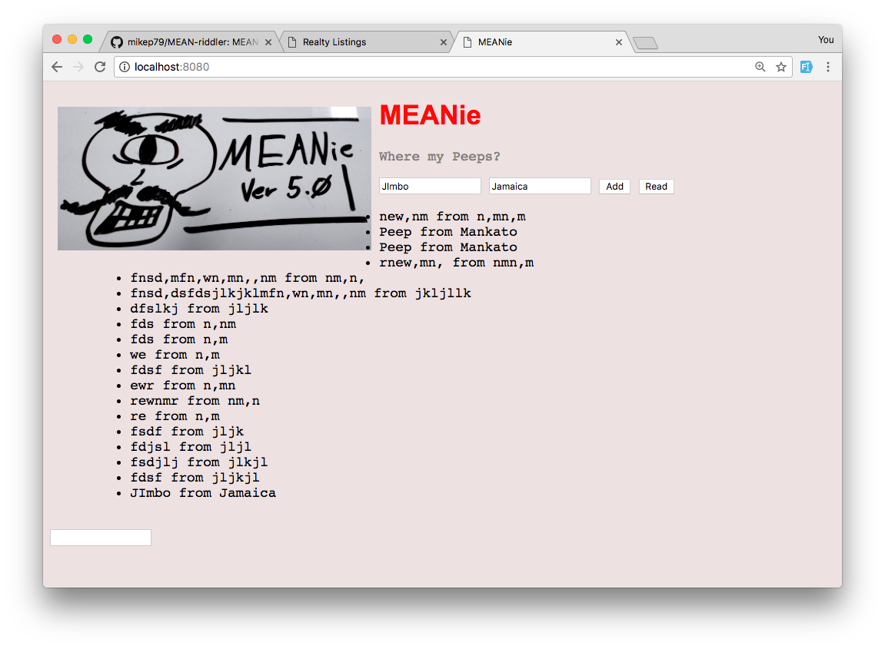

# Meanie
Prime assignment. Find errors in code. App allows user to add a peep with name and location to a Mongo database, and view all peeps. Focus on git branch management.

 

 

## Technology Used
JavaScript, AngularJS, HTML, CSS, MongoDB, Node.JS, Express.JS.